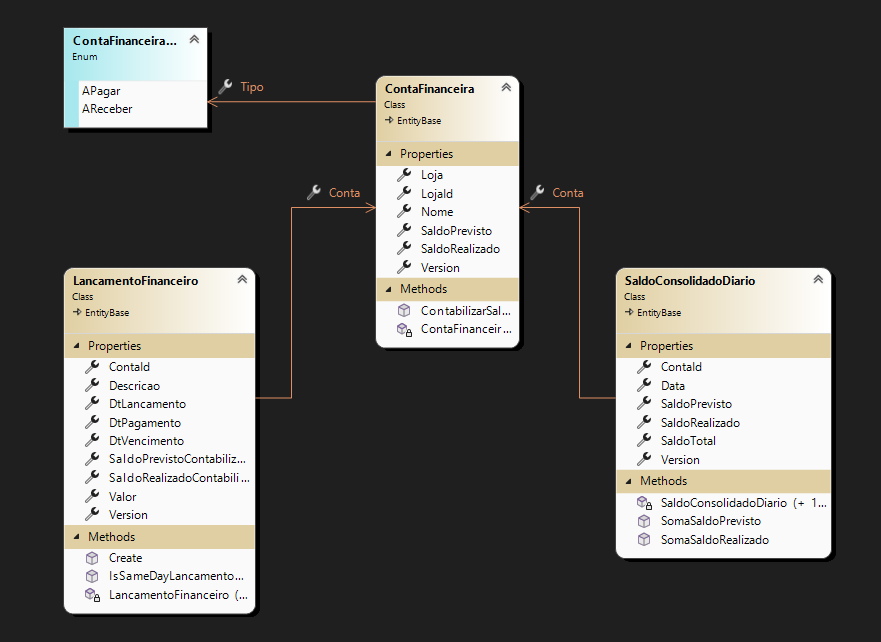
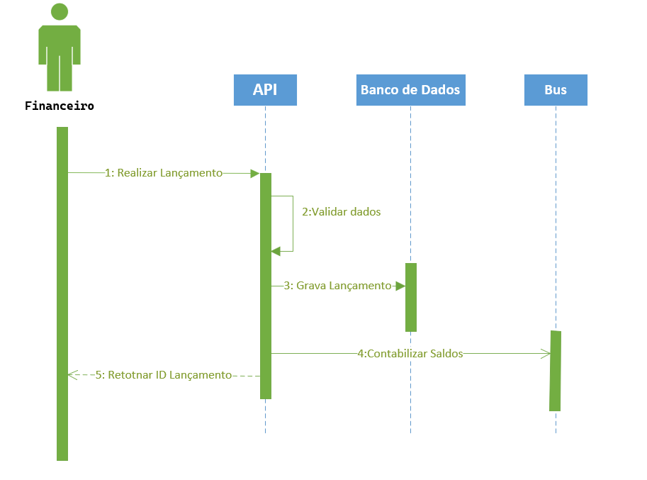

# DOCUMENTAÇÃO DE ARQUITETURA DO SISTEMA - PROJETO MERCADO D.

## 1. Conseito do Projeto

Este é um projeto usando `Clean Architecture`, utilizando blocos de construção do `Domain-Driven Design`. \
As operações de leitura e escrita foram separadas de acordo com o padrão `CQRS`. \
A observabilidade do sistema é garantida pela implementação do `OpenTelemetry` e do `Aspire Dashboard`. \
Além disso, você encontrará implementações de padrões de design como mediador, fábrica, estratégia e vários outros. 

A implementação da lógica de domínio de negócios é reduzida ao mínimo. \
Casos de uso selecionados foram implementados para demonstrar a comunicação entre camadas e o uso de eventos de domínio e integração.

## 2. Estrutura do projeto

Diferente de um projeto tradicional DDD, foi inseridada uma na camada `Cross-Cutting` que segue como espaço para 
biliotecas internas de apoio ao projeto. \
Nenhum projeto no da camada `Cross-Cutting` pode fazer referência a nenhum projeto da solução.

Também foi inserido o conseito de inversão de dependência no projeto `MercadoD.Di.Ioc` deixando mais fácil a injeção de 
dependencia para projetos futura da camada de apresentação.
Toda injeção de dependencia é feita internamete dentro de cada projeto deixando suas implementações protegidas e
e dando um comportamento de separeção de resposabilidade. \
O projeto `MercadoD.Di.Ioc` chama a implementação de cada projeto exceto a camada de apresentação realizando 
a integração completa da injeção de dependência.

A orquestração local fica a cargo do projeto `MercadoD.Host` que provisiona toda infra e configuração.

## 3. Testes Unitários

Os testes unitários foram implementados com o `xUnit` e estão na solução dentro da sua camada respectiva.

Ex.: Os testes do projeto `MercadoD.Domain.Tests` estão na mesma pasta do projeto `MercadoD.Domain`.

## 4. Domínio do Sistema

### 4.1. Classes principais

### 4.2. Fluxo criação de lançamento

A API valida os dados, grava o lançamento no banco de dados e envia para o `Service Bus` o evento 
de domínio `LancamentoFinanceiroCreatedDomainEvent`. 

Posteriormente o Worker presenta na `API` consumirá o evento e realizará a contabilização dos saldos da conta e saldos diários. \
O sistema funcina com `Saldo Previsto` e `Saldo Realizado`, ou seja tem regra implementada quanto a data de pagamento.\
Essa abordagem visa dar uma visão de previsão de saldo da conta financeira.
